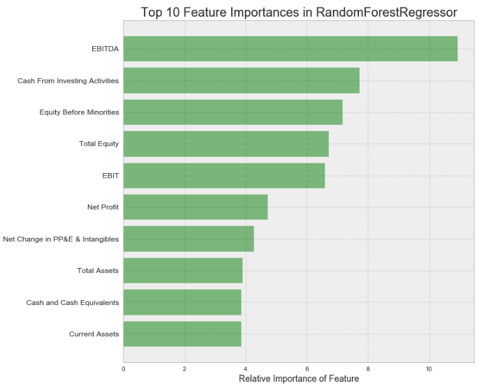

# Stock Valuation Prediction
## The Goal
Over the past three years I have been pursuing the CFA(Chartered Financial Analyst) charter and hope to finish the process this summer.  The curriculum has a large focus on financial statement analysis and company valuation.  Traditionally, valuation models fall into two separate categories:  discounted cash flow(DCF) or a market multiple-based approach.

The goal for this project was attempt to build an alternative model that would take a company’s financial statements from the prior twelve months and use those inputs to predict the market capitalization of the company at the time of their most recent financial statement release. Ultimately, my desire is to build a tool that can help me as a financial analyst.

* Identify patterns that exist among companies from the same sector and market cap grouping  
* Evaluate the efficacy of using cluster labels to add signal to the model and reduce model error measures
* Quantify and interpret feature importance to model prediction

## The Data
This project is an extension of the clustering analysis I performed in [Clustering by Fundamentals](https://github.com/dayskipping/Clustering_by_Fundamentals). I return to the same dataset sourced from [SimFin](https://simfin.com "Simfin homepage"), an open source project providing access to fundamental company data. The final dataset used was comprised of 1004 different companies and included a total of 68 features (61 without cluster labels).

### Features
The dataset includes financial statement data taken from a company's income statement, balance sheet, and cash flow statement for the trailing twelve months from the company's latest release date. I applied one hot encoding to categorical variables in an effort to add additional signal to the model. These categorical variables were the sector classifications of each company and the cluster labels from the prior analysis.

### Distribution
As seen in the scatter matrix below, many of the features exhibited a positive correlation. This makes intuitive sense when considering figures such as revenues and expenses. 

The distribution of the dataset was fairly balanced across different market cap groupings however the variance of these groups showed distinct differences.

Taking a look at the distributions of companies from the same sector also shows a widely distributed set of market capitalizations.

## Modeling

### Steps Taken
1. t-Distributed Stochastic Neighbor Embedding(t-SNE) – Take subset of features(6 ratios) and reduce dimensions of that data into two-dimensional t-SNE space
2. K-Means Clustering - Cluster observations in 2-dimensional space discovered in t-SNE.
4. Run a linear regression as a naive model and establish a baseline point of comparison for other models  
3. Random Forest Regressor, Gradient Boosting Regressor – train an ensemble of decision trees with/without cluster labels

## Results

As we can see in the results table below, the models including cluster labels appeared to show marginally lower error measures. In addition, decision tree-based models displayed significant improvement over ordinary linear regression.

We can look into which features provided the greatest reduction in entropy when using tree-based models. The chart below displays the top ten most features from the Random Forest Regressor. Notably, **5/10 features** were related to company **earnings and cash flow**.

## Conclusion

Considering the large variance seen in the market cap of companies with similar attributes, it comes as no surprise  that a regression model predicting market cap has an extremely large error relative to the target.  

Key take-aways:
* The model performed the worst when predicting on small cap companies, which reflects the higher CV(std. dev./mean) seen in the data
* Tree-based models outperform a simple linear regression since a company’s market cap is not easily modeled with a linear combination of it’s financial statement features
* Using only the trailing twelve months of financial statement data fails to incorporate any forward-looking projections of earnings which are key to valuation

## Next Steps

Stock valuation can mainly be thought of as the present value of discounted future cash flows. The data used in this project failed to include any future projections of a company's earnings/cash flows. Future updates to this project will most certainly seek to include some form of forecasted financials. Additionally, there may be added value when considering a time series component to a company's past and future figures. I would like to explore how a recurrent neural network model performs in comparison to this tree-based approach.    
